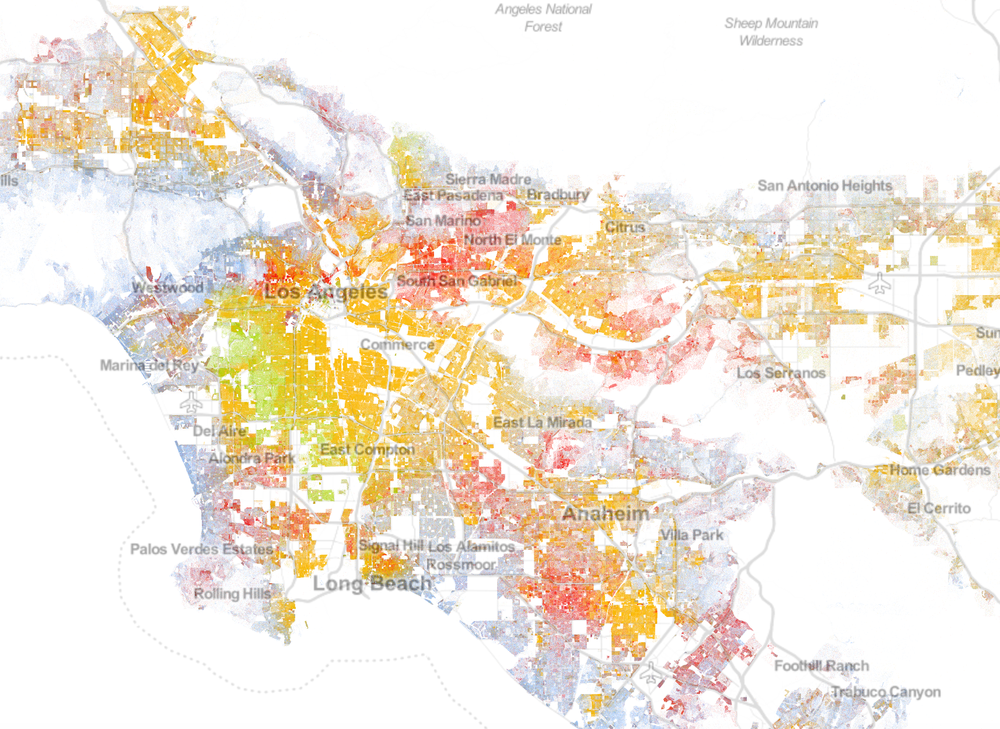
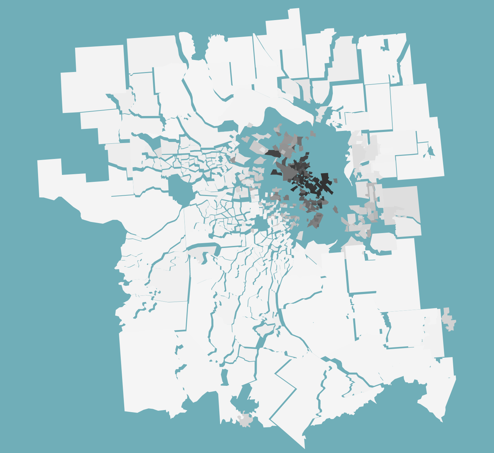
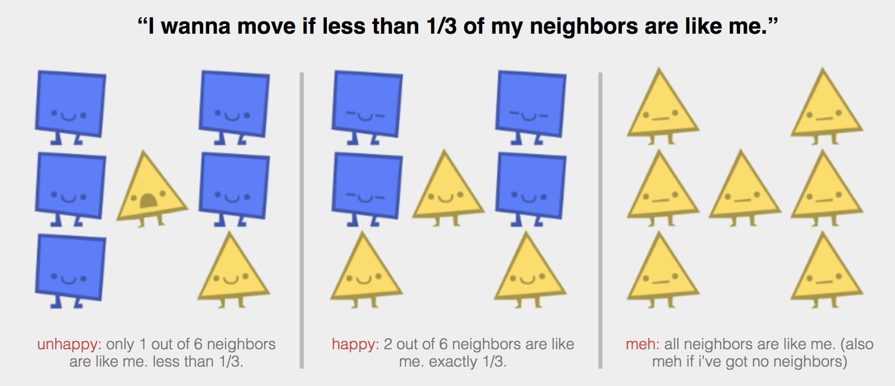
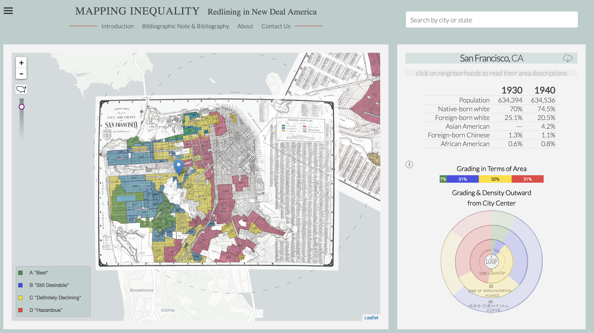
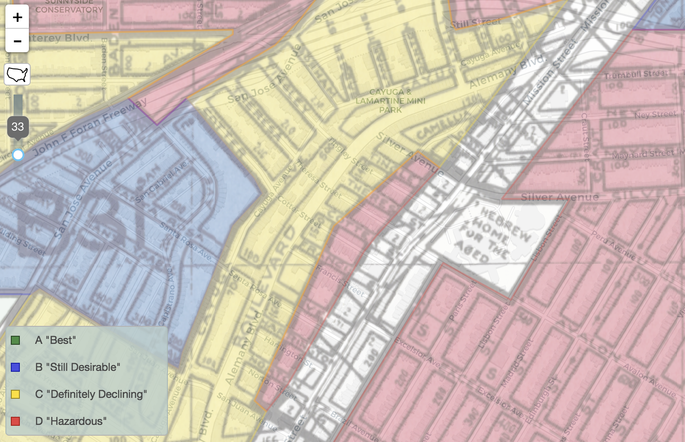
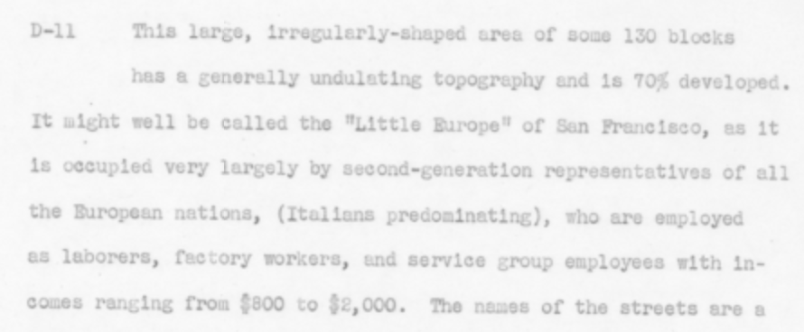

# Race and Neighborhoods
December 17, 2017

STEM TOPICS: data visualization, cartography/map making, interpreting maps, modeling and simulations

SOCIAL STUDIES TOPICS: Segregation, racism, urban development, urban planning, local history, original document research

# Where we live, Who lives near us, and Why
Students might know that there are lots of Italian restaurants in one neighborhood, the best BBQ in another, and Chinese restaurants in thrid. They might have noticed that neighborhoods "on one side of the tracks" are different than on the other. But, they might never have thought about why. 

There are a number of fantastic resources for thinking critically about where we live, who lives nearby, if they are different/similar to us, and what factors have led to segregation. This can be viewed through a historical lens, or a contemporary one, or both. 

From a STEM perspective, these are excellent resources for helping students to engage meaningfully with data and see the power of simulation/modeling. It also might drive questions about averages vs aggregation. 

## [Racial Dot Map](https://demographics.virginia.edu/DotMap/)

I've used the Racial Dot Map in classrooms of both 5th graders and 11th graders. It's an amazing entry point into thinking about data visualization, and how data can help us ask questions about our neighborhoods, and lead to questions about why this data is the way it is (what causes led to the segregation we see in so many neighborhoods.

One of my favorite aspects is that every person in America included in the Census is a dot in the visualization. Plus, it includes all of the United States, so it's easy to ground the conversations in a place that is familiar to the students while also helping them see these familiar places in a new light. 

### Who is counted in the data? And who isn't? 
Because the map is so concrete (every person is a dot) and about familiar places (your neighborhoods), it's also a great entry point for asking critical questions about what the data really means: who is included and who isn't. When I shared this with a 5th grade class and explained that it included everybody in American in 2010, one student asked if she'd moved to the US in 2014 does that mean that she's not on the map. Another student then asked if homeless people are included and how, which is a fantastic question. The question of "what does the data actually represent" is so critically important to all data analysis and visualization, and so easy to overlook. 

Note the blue square that stands out against a red/orange background in the southern part of San Francisco.
Note the blue square that stands out against a red/orange background in the southern part of San Francisco.

### A starting point for open-ended questions
If students start asking questions about "why", it opens up a great chance to do additional research. For example, when I introduced a class of 11th graders in San Francisco to the Racial Dot Map, they noticed that there was a bright blue box surrounded by red/orange dots in south San Francisco. They then switched to Google Maps to see what was in that spot on Google Maps. Turns out, it's the Jewish Home of San Francisco, an assisted living facility that dates back to 1871. Therefore, a question of where do people live now opens up into a question about how neighborhoods have changed or stayed the same over time. You could also image using this map as a starting point for research projects about the history of their neighborhood. 

You can encourage this type of exploration by asking students to find two things that surprise them about the map. Then write down a question related to what they noticed, and think of resources that would help them answer those questions. 

Worksheet: here is the worksheet that Louisa Connaughton and I developed when teaching data visualization to her 5th grade students and introducing them to the Racial Dot Map. 

## [Visualizing the racial divide](http://vallandingham.me/racial_divide/)

*Saint Louis as shown in Visualizing the Racial Divide*

Like the Racial Dot Map, Jim Valandingham's Visualizing the Racial Divide is also based on Census data about race. Here it is at the "census tract" level instead of "census blocks" which are much smaller. Each census tract is colored based on the percent of white/black people in the population. After the map "fractures" the distance between neighboring census tracts is based on how different that percent is. The more different the racial composition of neighboring tracts, the further they are pushed apart. 

This set of visualizations by Jim Vallandingham are less exploratory, and more visceral. You really "feel" the sense of the city fracturing along the racial boundaries. This could open up a conversation about how people react to different forms of visualization and media. How does this compare to the Racial Dot Map? For what purposes or audiences is one more effective than the other? From social perspective, what factors might contribute to these divides? 

 
## [Parable of the Polygons](http://ncase.me/polygons/)

Students might assume at this point that there always has to be somebody at fault, or that if people no longer want to be segregated than we'll get more mixed neighborhoods automatically. 

The Parable of the Polygons uses simulations, using yellow triangles and blue squares instead of race, to explore how you can end up with segregation even if everybody is happy to live in a mixed neighborhood. And, that once things are segregated, there needs to be a desire to de-segregate to undo it.

This explorable offers a great chance to think critically about how small desires can add up at a systemic level, even when nobody is doing anything "wrong."  For example, iut shows that even if all anybody wants is that some of the people nearby are like them, that is still enough to lead to large-scale segregation. 

Additionally, it's a wonderful example of the power of simulation and modeling. As computing power has increased, we use modeling and simulation more in industry and academia to learn about the world and make decisions. This is a great way to experience that method of problem solving. 

Because this explorable focusses on (very cute, approachable) shapes, rather than people and race, it gives a way to engage with these challenging topics in a more approachable way as well.

Thanks to Vi Hart and Nicky Case for creating this wonderful piece. 

## [American Panorama](https://dsl.richmond.edu/panorama/redlining/)

If you want to explore the historical context in more depth, the University of Richmond's American Panorama project brings historical documentation into the picture. Specifically, it includes original maps of "red-lining" from cities across America. This could be combined with the Racial Dot Map to look at how the lines between races visible in the maps now relate to the original red-lining maps from the first half of the 1900s. 

Indeed, you can see the Jewish Home for the Aged below, which is now the blue dots in a sea or red/orange dots. 

Interestingly, while the neighborhood surrounding the "Hebrew Home for the Aged" is now populated by Hispanics and Asians it was at the time occupied by second-generation Americans of European decent. But, was labeled "Hazardous" for lending. 

Overall, this is a treasure trove of original documents. These in particular come from the influential Home Owners Loan Corporation (HOLC). From the introduction: "Over the last thirty years especially, scholars have characterized HOLC's property assessment and risk management practices, as well as those of the Federal Housing Administration, Veterans Administration, and US. Housing Authority, as some of the most important factors in preserving racial segregation, intergenerational poverty, and the continued wealth gap between white Americans and most other groups in the U.S. Many of these agencies operated under the influence of powerful real estate lobbies or wrote their policies steeped in what were, at the time, widespread assumptions about the profitability of racial segregation and the residential incompatibility of certain racial and ethnic groups. Through HOLC, in particular, real estate appraisers used the apparent racial and cultural value of a community to determine its economic value."

## Summary
From a societal and historical point of view, these four websites could help students to discover the segregation in their own neighborhoods, "feel" how these divides affect cities across the United States, simulate how even small biases can lead to segregation even without anybody being "to blame" and de-segregation will require people to seek out mixed neighborhoods, and to see how in the history of the United States there have also been damaging policies that drove segregation that we still see today. 

From a STEM point of view, students could engage thoughtfully with 300 million data points and experience the power of simulation/modeling. 

From a communication/design/media point of view, students might discuss how these 4 methods of communicating similar topics differ. What is advantageous about one vs another? How does that relate to what message or information is being conveyed? Or, to who the audience is? 

#### Back to [Zan's Data Viz Blog for Teachers](https://raw.githubusercontent.com/zanarmstrong/dataviz-for-teachers/master/README.md)

